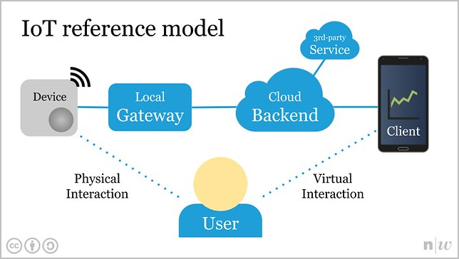

# #MakeZurich software intro
Introduction to software and platforms available at [MakeZurich.ch](http://makezurich.ch/).

Found a bug or have a question? [Submit an issue](../../issues).

## Internet of Things
Here's a simple reference model for Internet of Things (IoT) applications:

## Device
A device contains a microcontroller, wireless connectivity, and sensors or actuators.

Connectivity options include Bluetooth Low Energy (BLE) and LoRaWAN.

To build a custom device, read the [#MakeZurich hardware intro](https://github.com/make-zurich/makezurich-hardware-intro).

## Gateway
A gateway forwards data from a device to the backend and vice versa.

### TheThingsNetwork LoRaWAN Gateway
In Zürich [there are plenty of TTN LoRaWAN gateways](https://www.thethingsnetwork.org/community/zurich/) already.

You can also [build you own TTN LoRaWAN gateway](https://www.thingiverse.com/thing:1665467).

Or use an [indoor](https://www.thethingsnetwork.org/docs/gateways/thethingsindoor/) or [outdoor](https://www.lorixone.io/) gateway.

### Raspberry Pi as a BLE Gateway
See [this tutorial](http://www.tamberg.org/fhnw/2019/hs/IoT06RaspberryPiGateway.pdf).

## Backend

### The Things Network LoRaWAN Backend
[The Things Network](https://www.thethingsnetwork.org/) (TTN) is a global, open network for sensors and other connected devices. Uses a protocol called LoRaWAN. Check [docs and examples](https://www.thethingsnetwork.org/docs/).

There are 4 basic components in a LoRaWAN network:
 - End nodes (sensors): this is the hardware you are building. See all previous sections.
 - Gateways: the community has deployed many of them. See [coverage here](https://ttnmapper.org/).
 - Network server: there is a global network server, and additionally, the Swiss communities operate a local network server (interconnected to the global one). Check the [global console](https://console.thethingsnetwork.org/) and the [swiss console](https://console.ttn.opennetworkinfrastructure.org/).
 - Application: this is where you receive the data from your sensor and store it/visualize it/etc.

More details about LoRaWAN: `Crash course: LoRaWAN and The Things Network`, March 23rd, 19:00 at SmartCity-Lab.

### Accessing your data

Messages are received/sent to/from the application side via [MQTT](https://www.thethingsnetwork.org/docs/applications/mqtt/). There are plenty of MQTT libraries for every language. Additionally, there are specific wrappers/libraries for TTN that simplify access to the data streams.

- [Node-RED](https://www.thethingsnetwork.org/docs/applications/nodered/)
- [Python](https://www.thethingsnetwork.org/docs/applications/python/)
- [Node.js](https://www.thethingsnetwork.org/docs/applications/nodejs/)
- [Java](https://www.thethingsnetwork.org/docs/applications/java/)
- [Go](https://www.thethingsnetwork.org/docs/applications/golang/)

### Hosting on Virtual Machines

If you need hosted virtual machines to run your application, [datacenter light](https://datacenterlight.ch/) offers free VMs during MakeZurich (running on 100% renewable energy). Send an email to [support@ungleich.ch](mailto:support@ungleich.ch) with the subject `MakeZurich VM` and specify the VM that you need for the event:

- cpu cores (1..8)
- ram (1..16) gb
- ssd size (10..50) gb
- native ipv4 required (yes/no)

## Client

### Web app
TODO

### Android app 
TODO

### iOS app
TODO

## License
This tutorial by [MakeZurich.ch](http://makezurich.ch/) is licensed under [CC BY 4.0](https://creativecommons.org/licenses/by/4.0/).
